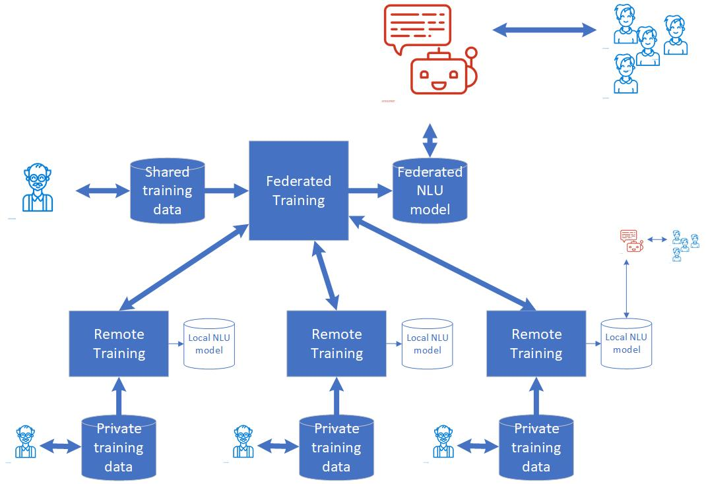

# fnlu
Software for Federated NLU; Project: EKTB78 Liitõppe rakendamise võimalused dialoogiandmete põhjal

## Description
Nowadays, many companies and institutions use virtual assistants to relieve the work of customer support professionals and ensure continued communication with the organization beyond business hours.

A reliable, high-quality virtual assistant can not be developed without a good NLU model, particularly an intent detector.

This project is dedicated to addressing challenges associated with the development of sophisticated bots designed to cater to the diverse needs of multiple organizations. Our objective involves constructing independent bots for each organization while concurrently creating a unified bot capable of serving the collective requirements of all participating entities. This approach empowers us to meticulously develop and assess bots tailored to the unique demands of individual organizations. Subsequently, these individualized bots can seamlessly integrate into a unified bot, ensuring a cohesive user experience.

The rationale behind the creation of a unified bot stems from the realization that end users often lack awareness of, and interest in, the specific bot they are interacting with. 

To illustrate this solution architecture, consider the following depiction:

The project encompasses various remote bot training sites where bot trainers autonomously develop and test their respective bots. These trainers manage their private training data, training local Natural Language Understanding (NLU) models that can be employed within their specific remote bots as needed.

In addition to the remote training sites, a central training site plays a pivotal role in the federated learning process. At this central location, a singular NLU model is trained using a federated training approach. The central federated training process aggregates NLU model parameters from the remote training sites, consolidating them into a cohesive federated NLU model. Notably, the federated training process not only acquires parameters from the remote nodes but may also incorporate its own training data.

The outcome of this federated training process is a central bot equipped with the federated NLU model. This central bot possesses the capability to identify intents irrespective of their origin, as the federated NLU model recognizes intents defined in shared training data and any of the remote sites. This innovative approach ensures a versatile and inclusive bot system that effectively addresses the intricate needs of diverse organizations.

Intent detection models are trained using a large, representative amount of example data. Depending on institution type the data might be sensitive or scattered among many institutions.

The solution in such cases is federated learning that involves training separate intent detection modules on each data holder premisses and sharing model parameters with the Server.

Using parameters from all the involved data holders the Server builds a single common intent detection model.

In such a way, the data holder's data in text form does not leave premisses, shared are only parameters in a binary format.
It allows for the preservation of the privacy of the data and reduces data exchange load.

Below is the architecture of the federated system with the Server and several remote modules.

## Content
This repository contains 6 directories.

### VectorizerService

Directory [VectorizerService](VectorizerService) contains container code for the vectorizer based on the LaBSE embedding model.

### VectorizerServiceSonar

Directory [VectorizerServiceSonar](VectorizerServiceSonar) contains container code for the vectorizer based on the SONAR embedding model.

### IntentDetector

Directory [IntentDetector](IntentDetector) contains the container code for the intent detector.

### rasa

Directory [rasa](rasa) contains an example Rasa bot project with a custom intent detector trained/accessed through the Web Service.

### Other

- Contains several training data fails in .json format for training separate models (vector stores).
- Contains script file *MergeFaiss.py* for merging several vector stores. Argument 'vec_stores' contains a file with vector stores' names to merge, and argument 'out_model' contains the name of the merged vector store.

### Prototype

Directory [Prototype](Prototype) contains setup instructions on how to set up the system with several client nodes and one server node.
